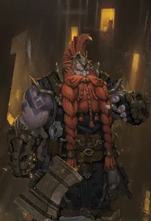

# Loa Data Smith

<p align="center">
    
</p>


Small project which extracts json from [LOA Logs](https://github.com/snoww/loa-logs) into readable structure.

# Getting Started

```shell
git clone https://github.com/averageeucplayer/loa-data-smith
cd loa-data-smith
cargo build
cargo run
```

# Examples

Lookup guardian raid boss

```rust
let npcs = Npcs::new();

let guardian_raid = GuardianRaid::from_npc_map(&npcs.by_name);
let gargadeth = guardian_raid.chaos_guardian_purification.one.gargadeth;
println!("{}", gargadeth);
```

Or other type of raid

```rust
let npcs = Npcs::new();

let kazeros_raid = KazerosRaid::from_npc_map(&npcs.by_name);
let boss = kazeros_raid.overture.gate_one.red_doom_narkiel;
println!("{}", boss);
```

Lookup class skill

```rust
let classes = Classes::new();

let skill = classes.berserker.skills_by_name.get("Red Dust");
println!("{:?}", skill);
```

All skill names for certain class

```rust
let skills = Skills::new();

let class = ClassWithSkills::new("Artist", &RAW_CLASS_BY_NAME_MAP, &skills.by_class_id);
let skills: Vec<_> = class.skills.iter().filter_map(|skill| skill.name).collect();
println!("{:?}", skills);
```